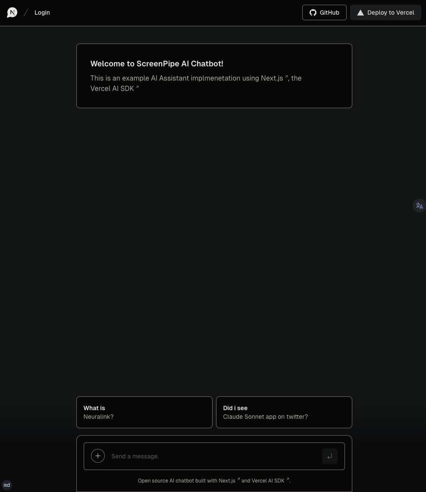
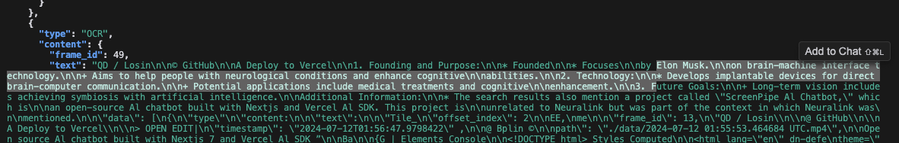

<p align="center">
    
</p>

<p align="center">
    <a href="https://screenpi.pe" target="_blank">
        
    </a>
</p>

<p align="center">
    <a href="https://www.bensbites.com/">
        
    </a>
    <a href="https://discord.gg/dU9EBuw7Uq">
        
    </a>
        <a href="https://twitter.com/screen_pipe"></a>
</p>


# 24/7 Screen & Audio Capture

Library to build personalized AI powered by what you've seen, said, or heard. Works with Ollama. Alternative to Rewind.ai. Open. Secure. You own your data. Rust.  
We are shipping daily, make suggestions, post bugs, [give feedback](mailto:louis@screenpi.pe?subject=Screenpipe%20Feedback&body=I'd%20like%20to%20use%20Screenpipe%20for%20...%0D%0A%0D%0AI%20cannot%20because%20of%20...%0D%0A%0D%0AWe%20can%20also%20have%20a%20call,%20book%20at%20https://cal.com/louis030195/screenpipe).


# Why?

Building a reliable stream of audio and screenshot data, where a user simply clicks a button and the script runs in the background 24/7, collecting and extracting data from screen and audio input/output, can be frustrating. 

There are numerous use cases that can be built on top of this layer. To simplify life for other developers, we decided to solve this non-trivial problem. It's still in its early stages, but it works end-to-end. We're working on this full-time and would love to hear your feedback and suggestions.

## Getting started

Struggle to get it running? [I'll install it with you in a 15 min call.](https://cal.com/louis030195/screenpipe)

<details>
  <summary>BACKEND</summary>


<details>
  <summary>MacOS</summary>

<details>
  <summary>Option I: Library</summary>

⚠️ You need to build from source if you have an Intel mac

1. Navigate to the folder where you want the data to be stored

2. Install dependencies:
```bash
brew install pkg-config
brew install ffmpeg
brew install jq
```
3. Install library
```bash
brew tap louis030195/screen-pipe https://github.com/louis030195/screen-pipe.git
brew install screenpipe
```
4. Run it:
```bash
screenpipe 
```
or if you don't want audio to be recorded
```bash
screenpipe --disable-audio
```
if you want to save OCR data to text file in text_json folder in the root of your project (good for testing):
```bash
screenpipe --save-text-files
```
if you want to run screenpipe in debug mode to show more logs in terminal:
```bash
screenpipe --debug
```

you can combine multiple flags if needed

[Didn't work?](https://github.com/louis030195/screen-pipe/issues/new?assignees=&labels=dislike&template=dislike.yml&title=brew+install+screenpipe+didnt+work)

</details>

<details>
  <summary>Option II: Install from the source</summary>

1. Install dependencies:
```bash
brew install pkg-config
brew install ffmpeg
brew install jq
```

Install [Rust](https://www.rust-lang.org/tools/install).

2. Clone the repo:

```bash
git clone https://github.com/louis030195/screen-pipe
```

This runs a local SQLite DB + an API + screenshot, ocr, mic, stt, mp4 encoding
```bash
cd screen-pipe # enter cloned repo
```

```bash
cargo build --release --features metal
```

Sign the executable to avoid mac killing the process when it's running for too long
```bash
codesign --sign - --force --preserve-metadata=entitlements,requirements,flags,runtime ./target/release/screenpipe
```

Then run it
```bash
./target/release/screenpipe # add "--disable-audio" if you don't want audio to be recorded
# "--save-text-files" if you want to save OCR data to text file in text_json folder in the root of your project (good for testing)
# "--debug" if you want to run screenpipe in debug mode to show more logs in terminal
```

[Didn't work?](https://github.com/louis030195/screen-pipe/issues/new?assignees=&labels=dislike&template=dislike.yml&title=cloning+screenpipe+didnt+work)
</details>

<br><br>
</details>

<details>
  <summary>Windows</summary>
  
  1. Install dependencies:

```bash
# Install ffmpeg (you may need to download and add it to your PATH manually)
# Visit https://www.ffmpeg.org/download.html for installation instructions

# Install Chocolatey from https://chocolatey.org/install
# Then install pkg config
choco install pkgconfiglite
```

 Install [Rust](https://www.rust-lang.org/tools/install).

  2. Clone the repo:

```bash
git clone https://github.com/louis030195/screen-pipe
cd screen-pipe
```

  3. Run the API:

```bash
# This runs a local SQLite DB + an API + screenshot, ocr, mic, stt, mp4 encoding
cargo build --release --features cuda # remove "--features cuda" if you do not have a NVIDIA GPU

# then run it
./target/release/screenpipe
```
</details>

<details>
  <summary>Linux</summary>

  1. Install dependencies:

```bash
sudo apt-get update
sudo apt-get install -y libavformat-dev libavfilter-dev libavdevice-dev ffmpeg libasound2-dev tesseract-ocr libtesseract-dev
```

 Install [Rust](https://www.rust-lang.org/tools/install).

  2. Clone the repo:

```bash
git clone https://github.com/louis030195/screen-pipe
cd screen-pipe
```

  3. Run the API:

```bash
cargo build --release --features cuda # remove "--features cuda" if you do not have a NVIDIA GPU

# then run it
./target/release/screenpipe
```

</details>
<br><br>
</details>

<details>
  <summary>FRONTEND</summary>

```bash
git clone https://github.com/louis030195/screen-pipe
```

Navigate to app directory
```bash
cd screen-pipe/examples/ts/vercel-ai-chatbot 
```
Set up you OPENAI API KEY in .env
```bash
echo "OPENAI_API_KEY=XXXXXXXXXXXXXXXXXXXXXXXXXXXXXXXXXXXXXXXXXX" > .env
```
[Didn't work?](https://github.com/louis030195/screen-pipe/issues/new?assignees=&labels=dislike&template=dislike.yml&title=vercel+app+didnt+work)

Install dependencies and run local web server
```bash
npm install 
```
```bash
npm run dev
```

<br><br>


<br><br>
</details>


## Usage
<details>
<summary>
Check which tables you have in the local database</summary>

```bash
sqlite3 data/db.sqlite ".tables" 
```
</details>
<details>
<summary>
Print a sample audio_transcriptions from the database</summary>

```bash
sqlite3 data/db.sqlite ".mode json" ".once /dev/stdout" "SELECT * FROM audio_transcriptions ORDER BY id DESC LIMIT 1;" | jq .
```

</details>
<details>
<summary>
Print a sample frame_OCR_text from the database</summary>

```bash
sqlite3 data/db.sqlite ".mode json" ".once /dev/stdout" "SELECT * FROM ocr_text ORDER BY frame_id DESC LIMIT 1;" | jq -r '.[0].text'
```

</details>
<details>
<summary>
Play a sample frame_recording from the database</summary>

```bash
ffplay "data/2024-07-12_01-14-14.mp4"
```
</details>
<details>
<summary>
Play a sample audio_recording from the database</summary>

```bash
ffplay "data/Display 1 (output)_2024-07-12_01-14-11.mp4"
```
</details>

<details>
  <summary>Example to query the API</summary>
  
1. Basic search query
```bash
curl "http://localhost:3030/search?q=Neuralink&limit=5&offset=0&content_type=ocr" | jq
```
"Elon Musk" prompt

</details>
<details>
  <summary>Other Example to query the API</summary>

  ```bash
# 2. Search with content type filter (OCR)
curl "http://localhost:3030/search?q=QUERY_HERE&limit=5&offset=0&content_type=ocr"

# 3. Search with content type filter (Audio)
curl "http://localhost:3030/search?q=QUERY_HERE&limit=5&offset=0&content_type=audio"

# 4. Search with pagination
curl "http://localhost:3030/search?q=QUERY_HERE&limit=10&offset=20"

# 6. Search with no query (should return all results)
curl "http://localhost:3030/search?limit=5&offset=0"
  ```
</details>
<br><br>
Keep in mind that it's still experimental.
<br><br>

https://github.com/user-attachments/assets/edb503d4-6531-4527-9b05-0397fd8b5976

## Use cases:

- RAG & question answering: Quickly find information you've forgotten or misplaced
- Automation: 
  - Automatically generate documentation
  - Populate CRM systems with relevant data
  - Synchronize company knowledge across platforms
  - Automate repetitive tasks based on screen content
- Analytics:
  - Track personal productivity metrics
  - Organize and analyze educational materials
  - Gain insights into areas for personal improvement
  - Analyze work patterns and optimize workflows
- Personal assistant:
  - Summarize lengthy documents or videos
  - Provide context-aware reminders and suggestions
  - Assist with research by aggregating relevant information
- Collaboration:
  - Share and annotate screen captures with team members
  - Create searchable archives of meetings and presentations
- Compliance and security:
  - Track what your employees are really up to
  - Monitor and log system activities for audit purposes
  - Detect potential security threats based on screen content

## Example vercel/ai-chatbot that query screenpipe autonomously

Check this example of screenpipe which is a chatbot that make requests to your data to answer your questions

https://github.com/louis030195/screen-pipe/assets/25003283/6a0d16f6-15fa-4b02-b3fe-f34479fdc45e

## Status 

Alpha: runs on my computer (`Macbook pro m3 32 GB ram`) 24/7.

- [x] screenshots
- [x] optimised screen & audio recording (mp4 & mp3 encoding, estimating 30 gb/m with default settings)
- [x] sqlite local db
- [x] OCR
- [x] audio + stt (works with multi input & output devices)
- [x] local api
- [ ] TS SDK
- [ ] multimodal embeddings
- [ ] cloud storage options (s3, pgsql, etc.)
- [ ] cloud computing options
- [ ] bug-free & stable
- [ ] custom storage settings: customizable capture settings (fps, resolution)
- [ ] data encryption options & higher security
- [ ] fast, optimised, energy-efficient modes


[Example with vercel/ai-chatbot project here inside the repo here:](https://github.com/louis030195/screen-pipe/tree/main/examples/ts/vercel-ai-chatbot)

## Why open source?

Recent breakthroughs in AI have shown that context is the final frontier. AI will soon be able to incorporate the context of an entire human life into its 'prompt', and the technologies that enable this kind of personalisation should be available to all developers to accelerate access to the next stage of our evolution.  

## Principles 

This is a library intended to stick to simple use case:
- record the screen & associated metadata (generated locally or in the cloud) and pipe it somewhere (local, cloud)

Think of this as an API that let's you do this:

```bash
screenpipe | ocr | llm "send what i see to my CRM" | api "send data to salesforce api"
```

Any interfaces are out of scope and should be built outside this repo, for example:
- UI to search on these files (like rewind)
- UI to spy on your employees
- etc.

## Contributing

Contributions are welcome! If you'd like to contribute, please read [CONTRIBUTING.md](CONTRIBUTING.md).

## Licensing

The code in this project is licensed under MIT license. See the [LICENSE](LICENSE.md) file for more information.

## Related projects

This is a very quick & dirty example of the end goal that works in a few lines of python:
https://github.com/louis030195/screen-to-crm

Very thankful for https://github.com/jasonjmcghee/xrem which was helpful. Although screenpipe is going in a different direction.

## FAQ

<details>
  <summary>What's the difference with adept.ai and rewind.ai?</summary>

  - adept.ai is a closed product, focused on automation while we are open and focused on enabling tooling & infra for a wide range of applications like adept 
  - rewind.ai is a closed product, focused on a single use case (they only focus on meetings now), not customisable, your data is owned by them, and not extendable by developers 

</details>

<details>
  <summary>Where is the data stored?</summary>
  
  - 100% of the data stay local in a SQLite database and mp4/mp3 files. You own your data
</details>

<details>
  <summary>Do you encrypt the data?</summary>
  
  - Not yet but we're working on it. We want to provide you the highest level of security.
</details>

<details>
  <summary>How can I customize capture settings to reduce storage and energy usage?</summary>
  
  - You can adjust frame rates and resolution in the configuration. Lower values will reduce storage and energy consumption. We're working on making this more user-friendly in future updates.
</details>

<details>
  <summary>What are some practical use cases for screenpipe?</summary>
  
    - RAG & question answering
    - Automation (write code somewhere else while watching you coding, write docs, fill your CRM, sync company's knowledge, etc.)
    - Analytics (track human performance, education, become aware of how you can improve, etc.)
    - etc.
    - We're constantly exploring new use cases and welcome community input!
</details>
