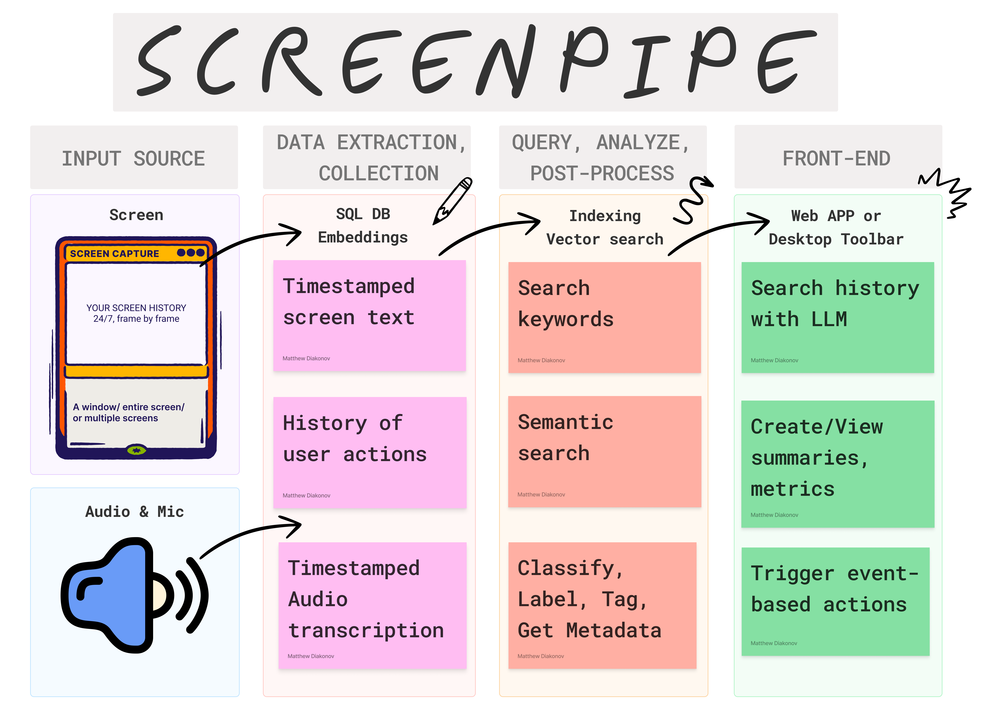

English | [简体中文](README-zh_CN.md) | [日本語](README-ja_JP.md)

   

<!-- ScreenPipe Title and Subtitle -->

   <h1 align="center">[ screenpipe ]</h1>
   
rewind.ai x cursor.com = your AI assistant that has all the context. 

   
24/7 screen & voice recording for the age of super intelligence. get your data ready or be left behind

<!-- Slogan -->

   <code>[ recording reality, one pixel at a time ]</code>

    

    

    
   
   
   

  
    

   

---

*news* 🔥
- [2024/11] [screenpipe is number 1 github trending repo (again)](https://x.com/louis030195/status/1859628763425931479)
- [2024/10] screenpipe has been backed by [Founders, Inc](https://f.inc/)
- [2024/09] [screenpipe is number 1 github trending repo & on hackernews!](https://x.com/louis030195/status/1840859691754344483)
- [2024/08] anyone can now [create, share, install pipes](https://docs.screenpi.pe/docs/plugins) (plugins) from the app interface based on a github repo/dir
- [2024/08] we're running bounties! contribute to screenpipe & make money, [check issues](https://github.com/mediar-ai/screenpipe/issues)
- [2024/08] we released Apple & Windows Native OCR.
- [2024/07] 🎁 screenpipe won Friends (the AI necklace) hackathon at AGI House (integrations soon)
- [2024/07] **we just launched the desktop app! [Download now!](https://screenpi.pe)**

---

# how it works?

we are shipping daily, make suggestions, post bugs, [give feedback](mailto:louis@screenpi.pe?subject=Screenpipe%20Feedback&body=I'd%20like%20to%20use%20Screenpipe%20for%20...%0D%0A%0D%0AI%20cannot%20because%20of%20...%0D%0A%0D%0AWe%20can%20also%20have%20a%20call,%20book%20at%20https://cal.com/louis030195/screenpipe).

# why?

in 2025, context won't be an issue anymore.

will you have the data ready?

## get started

there are multiple ways to install screenpipe:
- as a CLI for technical users
- as a [paid desktop app](https://screenpi.pe/onboarding) with 1 year updates, priority support, and priority features
- as a free forever desktop app (but you need to build it yourself). We're 100% OSS.
- get the desktop app 1 year license by sending a PR ([example](https://github.com/mediar-ai/screenpipe/issues/120#issuecomment-2275043418)) or [sharing about screenpipe online](https://screenpi.pe/onboarding/free-community)
- as a Rust or WASM library - check this [websocket](https://github.com/mediar-ai/screenpipe/blob/main/screenpipe-vision/examples/websocket.rs) to stream frames + OCR to your app
- [as a business](https://cal.com/louis030195/screenpipe-for-businesses) 

[**👉 install screenpipe now**](https://docs.screenpi.pe/docs/getting-started)

## create plugins

screenpipe has a plugin system called "pipe" which lets you run code in a sandboxed environment within the Rust code, [get started](https://docs.screenpi.pe/docs/plugins)

## other examples

[check examples](https://docs.screenpi.pe/docs/examples)

## star history

## contributing

contributions are welcome! if you'd like to contribute, please read [CONTRIBUTING.md](CONTRIBUTING.md).

   
   
