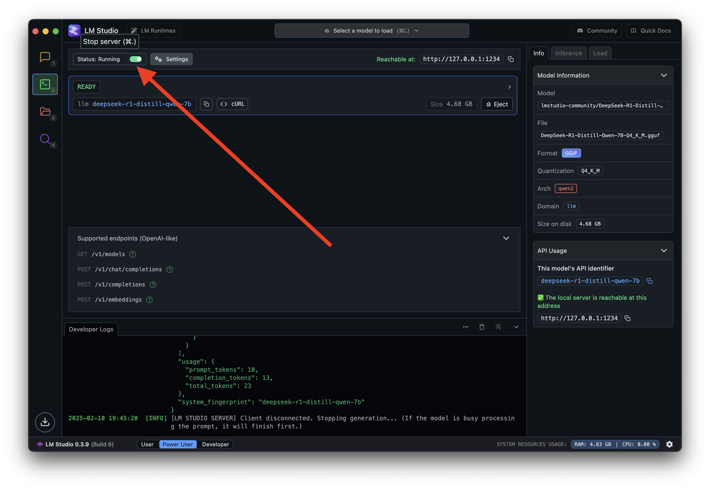
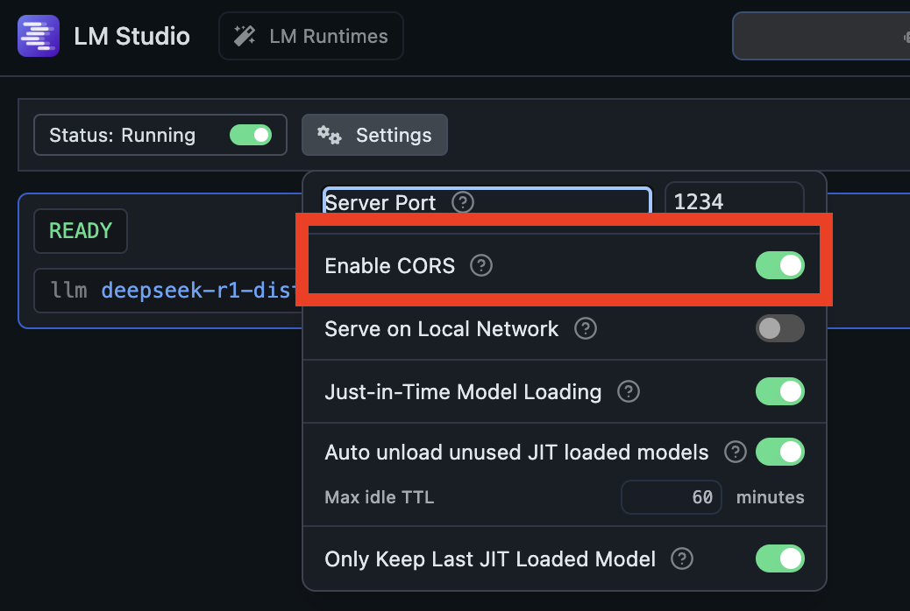
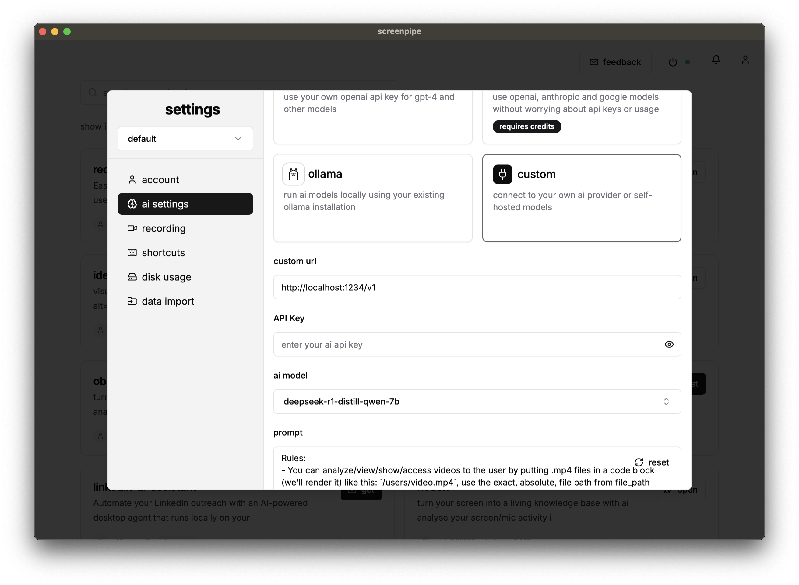

### choose your installation method

| method      | best for                          | pros                           | cons                                 |
| ----------- | --------------------------------- | ------------------------------ | ------------------------------------ |
| app         | personal users, quick setup       | easy gui, no terminal required | less customizable, automatic updates |
| cli         | developers, automation, scripting | fast, scriptable               | requires terminal familiarity        |

### install desktop app

- download the [desktop app](https://screenpi.pe) and follow the installation instructions.

### install cli

<Tabs>
  <Tab title="macos/linux">
    ```bash
    curl -fsSL get.screenpi.pe/cli | sh
    screenpipe
    ```
  </Tab>
  <Tab title="windows">
    ```powershell
    iwr get.screenpi.pe/cli.ps1 | iex
    screenpipe.exe
    ```
  </Tab>
</Tabs>

### verify installation

- run `screenpipe` or `screenpipe.exe` to verify successful installation.

### query data with javascript sdk

then query the data using our javascript sdk:

```typescript
import { pipe } from "@screenpipe/js";

async function queryScreenpipe() {
  // get content from last 5 minutes
  const fiveMinutesAgo = new Date(Date.now() - 5 * 60 * 1000).toISOString();

  const results = await pipe.queryScreenpipe({
    startTime: fiveMinutesAgo,
    limit: 10,
    contentType: "all", // can be "ocr", "audio", or "all"
  });

  if (!results) {
    console.log("no results found or error occurred");
    return;
  }

  console.log(`found ${results.pagination.total} items`);

  // process each result
  for (const item of results.data) {
    if (item.type === "OCR") {
      console.log(`OCR: ${JSON.stringify(item.content)}`);
    } else if (item.type === "Audio") {
      console.log(`transcript: ${JSON.stringify(item.content)}`);
    }
  }
}

queryScreenpipe().catch(console.error);
```

now download the [desktop app](https://screenpi.pe) to start capturing your screen and audio!

### connect to ai providers

screenpipe can connect to various ai providers to process your data. here's how to set up popular local ai providers:

<Tabs>
  <Tab title="ollama">
    1. install ollama from [ollama.ai](https://ollama.ai) and run your preferred model

    ```bash
    # start ollama with your preferred model
    ollama run phi4:14b-q4_K_M
    ```

    1. then configure screenpipe to use ollama in your settings with model phi4:14b-q4_K_M

    that's it\! screenpipe will now use ollama for ai like search, rewind, and more. you can change the model in settings.
  </Tab>
  <Tab title="lmstudio">
    to use lmstudio:

    1. download and install [lmstudio](https://lmstudio.ai)
    2. select your preferred model
    3. start the local server

    <Frame>
      
    </Frame>

    <Frame>
      
    </Frame>

    <Frame>
      
    </Frame>
  </Tab>
</Tabs>

verify your ai provider by using the search or chat features in the app!

### for developers

if you're interested in building from source or contributing to screenpipe, please check our [contributing guide](https://github.com/screenpipe/screenpipe/blob/main/CONTRIBUTING.md).
