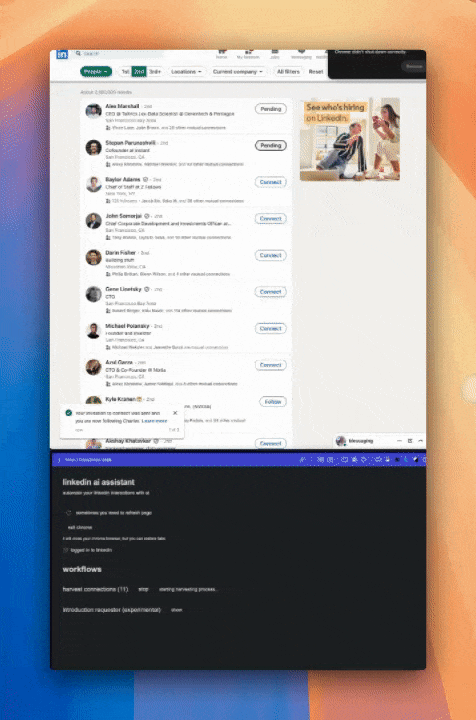

Automate your LinkedIn outreach with an AI-powered desktop agent that runs locally on your computer. No password required, works in the background without interfering with your keyboard. Smart targeting finds relevant prospects based on industry and role, while AI generates personalized messages using profile context. Built with safety in mind - uses human-like behavior and rate limiting to protect your account.

https://github.com/user-attachments/assets/c53b1156-b279-4a9d-9325-32bc27fba527

<!--

-->

## Features

- 🛡️ Exceptional safety: Runs as a desktop app with human-like behavior
- 👥 Smart targeting: Finds prospects based on industry & mutual connections
- 🤖 AI messaging: Generates personalized outreach using profile context
- 💬 Drip campaigns: Automated sequences with reply detection
- ⚡ Multi-source targeting: Connect via search, groups, and profile visitors
- 📊 Data extraction: Safely logs profile data and messaging history

